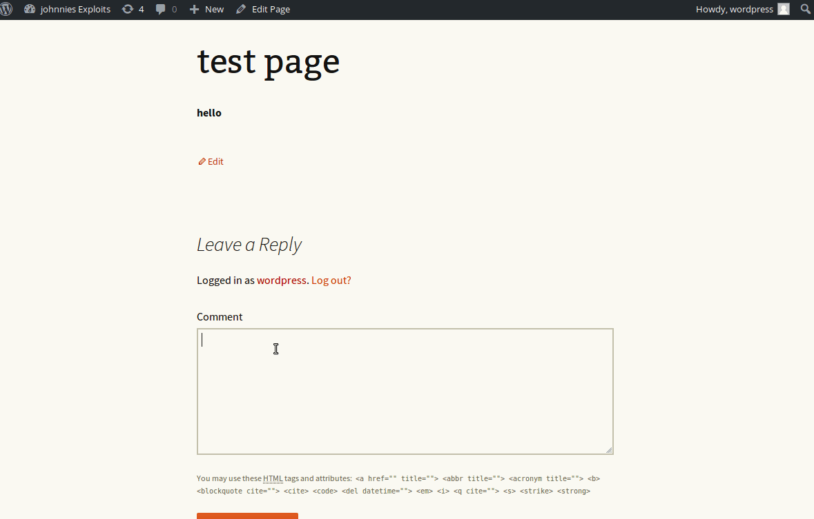

# Project 7 - WordPress Pentesting

Time spent: **3** hours spent in total

> Objective: Find, analyze, recreate, and document **five vulnerabilities** affecting an old version of WordPress

## Pentesting Report

1. WordPress <= 4.2.2 - Authenticated Stored Cross-Site Scripting (XSS) (CVE-2015-5622)
  - [ ] Summary: This is an XSS attack used to inject js into WordPress comments. It is trigger when the page loads and the comment is viewed.
    - Vulnerability types: XSS
    - Tested in version: 4.2.2
    - Fixed in version: 4.2.3
  - [ ] GIF Walkthrough: 
  	
  - [ ] Steps to recreate: 
	- Have version 4.2 installed
	- Create a wordpress account and login
	- Create/go to a post and add a comment that contains js:
	- Example script used: 
	- When comment is added/page is refreshed, script will run on user visiting the page.
  - [ ] Affected source code:
    - [Link 1](https://core.trac.wordpress.org/browser/tags/version/src/source_file.php)
2. Unauthenticated Stored Cross-Site Scripting (XSS) (CVE-2015-3440)
  - [ ] Summary: A XSS attack where the user is unathenticated and is able to inject malformed html in the comments. This is due to mySQL truncating data that is over 64kiB, allowing the unathenticated user to suppply any attributes in the allowed html tags.
    - Vulnerability types: XSS
    - Tested in version: 4.2
    - Fixed in version: 4.2.1
  - [ ] GIF Walkthrough: 
  - [ ] Steps to recreate: 
	- Make sure you are signed out.
	- Create an html script containing 64kiB of data along with your malicious payload.
	- Submit and script will run once posted and on refresh.
  - [ ] Affected source code:
    - [Link 1](https://core.trac.wordpress.org/browser/tags/version/src/source_file.php)
3. Clickjacking Vulnerability (CVE-2011-3127
  - [ ] Summary: The clickjacking attack allows the attacker to redirect a user to a different site, steal their cookie, etc. by loading in an iframe onto the page with a malicious link/script.
    - Vulnerability types: Clickjack/CSRF
    - Tested in version: 4.2
    - Fixed in version: N/A
  - [ ] GIF Walkthrough: 
  - [ ] Steps to recreate:
	- Simply craft basic html with an iframe in the body of the code with a link to your target site.
	- Once posted, the iframe can either bring you to a site an conduct a CSRF attack or you can have it reveal the cookie of the current user.
  - [ ] Affected source code:
    - [Link 1](https://core.trac.wordpress.org/browser/tags/version/src/source_file.php)
1. (Optional) Vulnerability Name or ID
  - [ ] Summary: 
    - Vulnerability types:
    - Tested in version:
    - Fixed in version: 
  - [ ] GIF Walkthrough: 
  - [ ] Steps to recreate: 
  - [ ] Affected source code:
    - [Link 1](https://core.trac.wordpress.org/browser/tags/version/src/source_file.php)
1. (Optional) Vulnerability Name or ID
  - [ ] Summary: 
    - Vulnerability types:
    - Tested in version:
    - Fixed in version: 
  - [ ] GIF Walkthrough: 
  - [ ] Steps to recreate: 
  - [ ] Affected source code:
    - [Link 1](https://core.trac.wordpress.org/browser/tags/version/src/source_file.php) 

## Assets

List any additional assets, such as scripts or files

## Resources

- [WordPress Source Browser](https://core.trac.wordpress.org/browser/)
- [WordPress Developer Reference](https://developer.wordpress.org/reference/)

GIFs created with [LiceCap](http://www.cockos.com/licecap/).

## Notes

Describe any challenges encountered while doing the work

## License

    Copyright [2018] [Gianfranco Leto]

    Licensed under the Apache License, Version 2.0 (the "License");
    you may not use this file except in compliance with the License.
    You may obtain a copy of the License at

        http://www.apache.org/licenses/LICENSE-2.0

    Unless required by applicable law or agreed to in writing, software
    distributed under the License is distributed on an "AS IS" BASIS,
    WITHOUT WARRANTIES OR CONDITIONS OF ANY KIND, either express or implied.
    See the License for the specific language governing permissions and
    limitations under the License.

